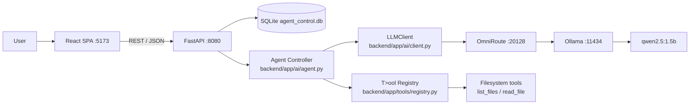
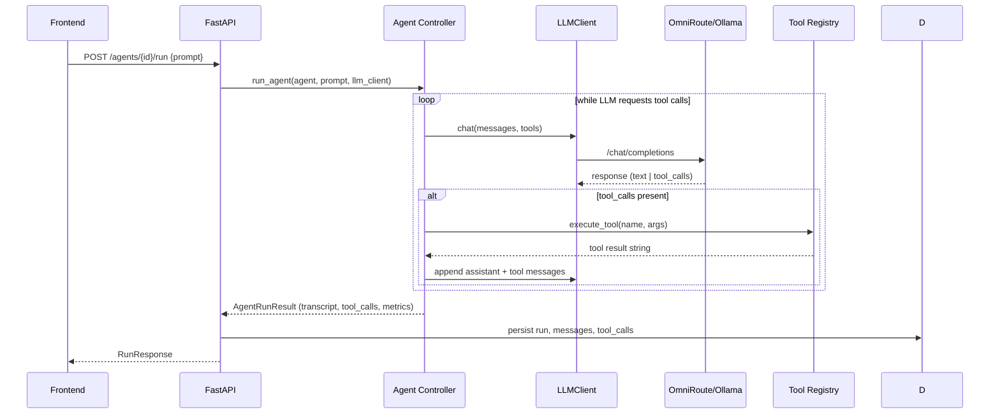

# Architecture

This document describes the architecture of the AI Agent Control Panel (Phase 8).

## Overview

The control panel is a full-stack web application for creating, running, and monitoring
AI agents that can call tools (function calling). It is provider-agnostic: backend talks
to any **OpenAI-compatible** chat-completions endpoint, currently routed through
**OmniRoute** to a local **Ollama** model.

## System diagram



## Request/response flow



## Components

### Backend (`backend/app`)

- **`core/config.py`** — Pydantic `Settings` reading `.env` from the project root
  (falls back to CWD). Exposes `OMNIROUTE_BASE_URL`, `OMNIROUTE_API_KEY`, `MODEL`,
  `WORKSPACE_DIR`.
- **`ai/client.py`** — thin OpenAI-compatible HTTP client (`LLMClient.chat`). Returns
  `LLMResponse` with parsed `tool_calls`.
- **`ai/agent.py`** — the agent loop. Up to `MAX_TOOL_ROUNDS` (10). Appends assistant
  + tool messages, builds `ToolCallRecord`s, and returns `AgentRunResult` including the
  full message transcript and `llm_requests` count.
- **`ai/prompts.py`** — `build_system_prompt`, `build_tool_definitions` (OpenAI function
  schema for each registered tool).
- **`tools/registry.py`** — decorator-based tool registry. `@register_tool(name)` adds a
  callable; `execute_tool(name, arguments)` resolves and runs it. New tools only require
  a new module + a definition in `prompts.py`.
- **`tools/filesystem.py`** — `list_files`, `read_file` operating inside the workspace
  with path-traversal guards.
- **`api/routes_runs.py`** — run lifecycle (+ transcript/message persistence),
  `GET /runs`, `GET /runs/{id}`, `GET /runs/{id}/tools`, `GET /runs/{id}/messages`,
  `GET /metrics`.
- **`db/models.py`** — `Agent`, `Run`, `ToolCall`, `Message`. `Run.llm_requests` counts
  LLM calls per run (added in Phase 8 via a guarded migration so existing DBs are not
  dropped).
- **`db/database.py`** — SQLite engine + `init_db()`. `init_db()` runs the guarded
  `ALTER TABLE` migration for `runs.llm_requests` on existing databases.
- **`db/seed.py`** — seeds the default `code-assistant` agent.

### Frontend (`frontend/src`)

- **`api/client.js`** — thin fetch wrapper for all endpoints including `fetchMetrics`
  and `fetchRunMessages`.
- **`pages/Dashboard.jsx`** — health + 8 metric cards (`/metrics`) + recent runs table.
- **`pages/RunDetail.jsx`** — vertical execution timeline (`RUN STARTED → LLM REQUEST →
  TOOL CALL → TOOL RESULT → FINAL RESPONSE`) plus full transcript.
- **`pages/RunHistory.jsx`, `AgentList.jsx`, `AgentDetail.jsx`** — list/detail pages.

## Database schema

```
agents   (id, name, description, system_prompt, model, enabled, created_at, updated_at)
runs     (id, agent_id FK, prompt, final_response, status, model,
          started_at, completed_at, duration_ms, llm_requests, error)
tool_calls (id, run_id FK, tool_name, arguments, result, status,
            started_at, completed_at, duration_ms)
messages (id, run_id FK, role, content, created_at)
```

Messages are stored per LLM exchange: `user` prompt, `assistant` (tool-call intent),
`tool` (results), and the final `assistant` response. `GET /runs/{id}/messages` returns
them in chronological order.

## Metrics

`GET /metrics` aggregates over all runs and tool calls: total/successful/failed runs,
success rate, average duration, average LLM requests per run, tool-call volume, error
tool calls, distinct agents, and last-run timestamp.

## Security

- Tools only operate inside the configured workspace; path traversal is rejected.
- No arbitrary shell execution; only registered tools can run.
- API keys live in gitignored `.env` and are never returned by any endpoint.